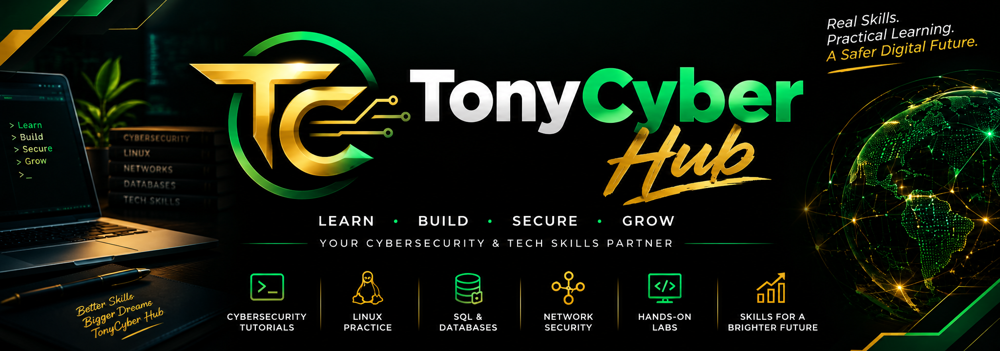

<!-- TonyCyber Hub Banner -->

 

👋 Welcome to TonyCyber Hub

TonyCyber Hub is my personal cybersecurity and technology learning space, where I document practical learning, hands-on labs, projects, and technical growth.

🧠 What I'm Learning

Area

Focus

🛡️ Cybersecurity

Security fundamentals, monitoring, defensive security

🐧 Linux

Command line, system administration, security labs

🌐 Network Security

Networking concepts, traffic analysis, detection

🗄️ SQL & Databases

MariaDB, SQL queries, data analysis

🧪 Hands-on Labs

Practical cybersecurity exercises and experiments

💻 Tech Skills

Building useful real-world technical skills

🚀 My Learning Philosophy

Learn → Practice → Build → Secure → Grow

I believe cybersecurity is best learned by combining knowledge with practical experience.

🧰 Tools & Technologies

Linux       SQL / MariaDB       Git & GitHub
Networking  Suricata             Log Analysis
Cybersecurity Labs              Virtual Machines

📌 Current Focus

🔐 Cybersecurity fundamentals

🐧 Linux security and administration

🌐 Network security

🗄️ SQL and database security

🚨 Network traffic detection with tools such as Suricata

🧪 Practical security labs

📈 The Goal

Build practical cybersecurity skills, document the journey, and keep growing.

⭐ TonyCyber Hub

Real Skills. Practical Learning. A Safer Digital Future.

